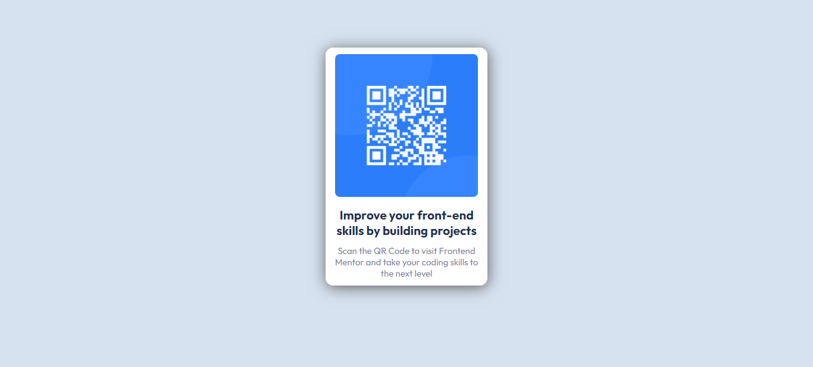

# Frontend Mentor - QR code component solution

This is my solution to the [QR code component challenge on Frontend Mentor](https://www.frontendmentor.io/challenges/qr-code-component-iux_sIO_H).

## Table of contents

- [Overview](#overview)
  - [Screenshot](#screenshot)
  - [Links](#links)
- [My process](#my-process)
  - [Built with](#built-with)
  - [What I learned](#what-i-learned)
  - [Continued development](#continued-development)
  - [Useful resources](#useful-resources)
- [Author](#author)

## Overview

### Screenshot



### Links

- Live Site URL: [GitHub Page](https://gustavohnramos.github.io/QR-Code/)

## My process

### Built with

- Semantic HTML5 markup
- CSS custom properties
- Mobile-first workflow
- [Google Fonts](https://fonts.google.com/) - For fonts

### What I learned

During this project i learned how to use hsl and its benefits

Exemple of hsl in use:

```css
.content {
  background: hsl(0, 0%, 100%);
}
```

### Continued development

I don't really understand responsive design yet, so that's what I will focus on for the moment

### Useful resources

- [What is hsl](<https://developer.mozilla.org/en-US/docs/Web/CSS/color_value/hsl()>) - This is an amazing article which helped me finally understand hsl. I'd recommend it to anyone still learning this concept.

## Author

- GitHub - [GustavoHNRamos](https://github.com/GustavoHNRamos)
